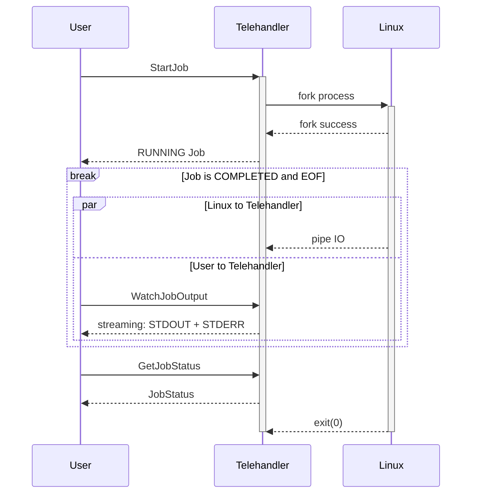
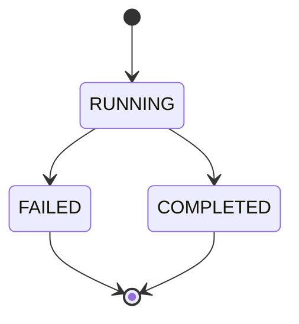

- Worker library with methods to start, stop, query status, and get the output of a job.
- Library should be able to stream the output of a running job.
  - Output should be from start of process execution.
  - Multiple concurrent clients should be supported.
- Add resource control for CPU, Memory and Disk IO per job using cgroups.
- Add resource isolation for using PID, mount, and networking namespaces.
- gRPC API to start, stop, query status, and get the output of a job.
- Use mTLS authentication and verify client certificate. Set up strong set of cipher suites for TLS and good crypto setup for certificates.
- Use a simple authorization scheme.
- CLI should be able to connect to worker service and start, stop, get status, and stream output of a job.


## What?

## Why?

## Details


Telehandler is a simple service that is used to start, stop, query status, and watch the output of an arbitrary Linux process over gRPC.
The context of each process execution is called a job and is tracked using the `Job` type.
When a process is started using `StartJob`, a [resource name][aip-122] is returned to the user along with an initial status.
The resource name returned by `StartJob` is required to be passed to `StopJob`, `GetJobStatus`, and `WatchJobOutput`.

To prevent one job from consuming all compute resources on the Telehandler host, all jobs have hard-coded limits for CPU, memory, and disk IO resources; additionally, all jobs are isolated into separate PID, mount, and network namespaces. For more information on both of these topics see [Resource Constraints](#resource-constraints) and [Process Isolation](#process-isolation).

A typical happy path scenario for running a job is outlined below:



### Job Lifecycle



- `RUNNING`: The underlying Linux process has been started, but has not exited.
- `FAILED`: The Linux process either failed to start or exited with a non-zero code.
- `COMPLETED`: The Linux process started and exited successfully.

The Telehandler Job lifecycle is minimal due to the simplistic and synchronous nature of this system. Each Job is started synchronously in the `StartJob` call, so there is no need for a `PENDING` state or a more complicated substate design. There are no retries; jobs are all one-shot and run to completion--unless the job is interrupted by a call to `StopJob`.

### Resource Constraints

The following resource constraints are hard-coded and enforced on all jobs using control groups (cgroups) v2:

- **CPU**: CPU usage is limited using fraction-seconds via `cpu.weight` such that each process is limited to `100ms` per-second or `10%` of each second.
- **memory**: A low threshold is not set for memory, the default value of `0` is used. Maximum allowed memory per-process is `512MiB` with a throttle limit of `75%`--that is, `memory.max == 512MiB` and `memory.high == 512MiB * 0.75`. No swap is available; therefore, `memory.swap.max` is pinned to `0`.
- **Disk IO**: Disk IO is limited per-partition to the following read/write rates:
    - Max read bytes per second (rbps): 
    - Max write bytes per second (wbps): 
    - Max read IO operations per second (riops): 
    - Max write IO operations per second (wiops): 


### Process Isolation

Jobs are isolated into separate PID, mount, and network namespaces. The host rootfs *is not* replaced, despite using a mount namespace--the mount namespace is primarily used to swap out `/proc` to hide host process information. To isolate the host network further, the hostname is forced to `sandbox`.

**IMPORTANT:** Due to scope, network connectivity was left out of this prototype, and the network namespace is unprovisioned; therefore, there is no external connectivity and any process requiring a network connection will fail.

### Foreman API

Job management is handled through the Foreman gRPC API that is outlined in the [proto spec](../proto/drrev/telehandler/foreman/v1alpha1/telehandler.proto).

#### Authentication

The Foreman API utilizes mTLS with TLS1.3 via the native [`crypto/tls`][crypto-tls] package to authenticate clients. All certificate key pairs are self-signed and use ECDSA P-384. ECDSA was chosen for performance. Curve P-384 was chosen as [recommended by NIST for non-repudiation][nist].

> Note: Cipher suites for TLS1.3 [_cannot_ be configured][cipher-suites] in the native Go `cytpto/tls` package. One of the following cipher suites are automatically selected: TLS_AES_128_GCM_SHA256, TLS_AES_256_GCM_SHA384, or TLS_CHACHA20_POLY1305_SHA256.

Adapting this prototype to a production environment would require minimal uplift in Kubernetes to utilize [cert-manager's csi-driver][csi] with mounted certificate key pairs.


#### Authorization

### Command Line Interface

The CLI provides a simple management interface for interacting with the Foreman API. Each remote procedure call (RPC) has an associated sub-command. At any time `help` can be run to get a full list of sub-commands. Additionally, each sub-command has a dedicated help section with a full description and any arguments specific to that command, i.e. `help start` will output a full description of the start and any arguments specific to `start`.

A full usage scenario might look like:
```bash
# Note the usage of `--` to signal the end of parameters.
# This MUST be included if the process to run includes arguments.
user@host$ ./telehandler start -- /bin/sh -c "sleep 30 && echo hello tele | tee /tmp/greeting"

user@host$ ./telehandler status 
```

- `start`: 
- `stop`:
- `status`:
- `watch`:


## Future Work

This section covers major concessions and future remediation approaches that can be taken to shore up the design.

### Job State

Typically, in a production system, there would be a worker pool that carry out execution of jobs that have not reached a terminal state. Asynchronous job status can be represented using `OPEN` and `CLOSED`: `OPEN` is an active state in which a job can progress further, and `CLOSED` is a terminal state.
Both `OPEN` and `CLOSED` would have multiple substates to further track status, depending on the requirements of the system, such as `OPEN.RUNNING` or `OPEN.SUSPENDED`.

### RootFS Replacement

Replacing the rootfs for full mount isolation can be added in the future; however, it would likely be better to use [libcontainer][runc] instead of using a custom implementation. Here is a rough outline of what the process looks like to replace a rootfs in the process mount namespace:
1. Download a root file system (rootfs), for example [alpine-minirootfs][alpine].
2. Extract a rootfs onto disk: `mkdir alpine-minirootfs && tar -xf alpine-minirootfs-*.tar.gz -C alpine-minirootfs`
3. Add the equivalent of `mount --rbind` to context initialization within the Executor to mount `alpine-minirootfs` using [`syscall.Mount`][mount] with flags `unix.MS_BIND | unix.MS_REC`.
4. Pivot root to prevent escape from the chroot using [`syscall.PivotRoot`][pivot_root] to swap the rootfs to `alpine-minirootfs` as part of context initialization.
5. Finally, change root into `alpine-minirootfs` using [`syscall.Chroot`][chroot].
6. The process now has a fully isolated rootfs.

### Network Connectivity

Network connectivity can be added--if desired--by adding a network bridge, virtual Ethernet devices, routes, and configuring network address translation (NAT) on the host.
The complexity of providing this capability made it untenable for a simple prototype.

[aip-122]: https://google.aip.dev/122
[runc]: https://github.com/opencontainers/runc/tree/main/libcontainer
[alpine]: https://alpinelinux.org/downloads/
[mount]: https://pkg.go.dev/syscall#Mount
[pivot_root]: https://pkg.go.dev/syscall#PivotRoot
[chroot]: https://pkg.go.dev/syscall#Chroot
[nist]: https://nvlpubs.nist.gov/nistpubs/specialpublications/nist.sp.800-57pt3r1.pdf
[csi]: https://cert-manager.io/docs/usage/csi/
[crypto-tls]: https://pkg.go.dev/crypto/tls
[cipher-suites]: https://cs.opensource.google/go/go/+/refs/tags/go1.23.2:src/crypto/tls/common.go;l=675-684