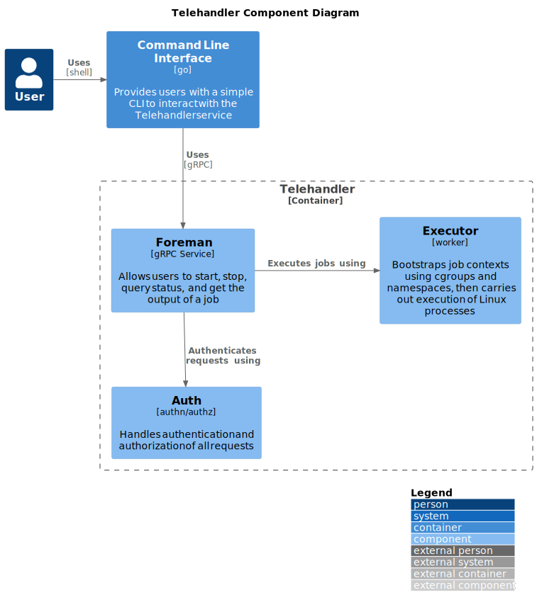
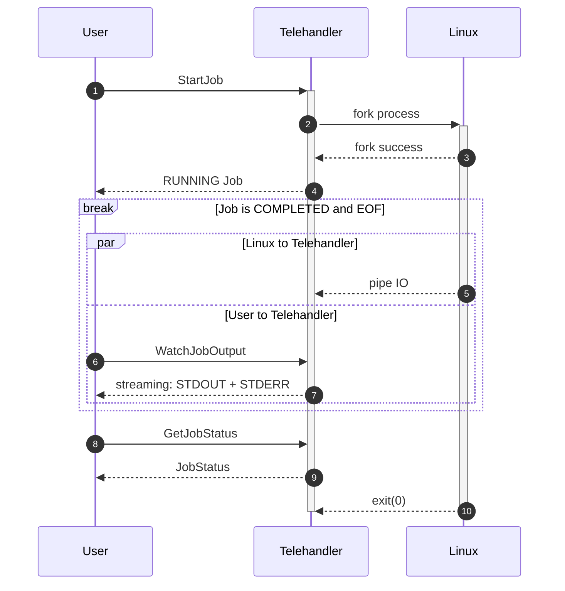
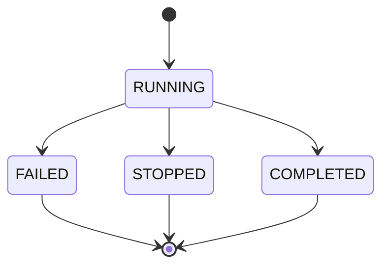
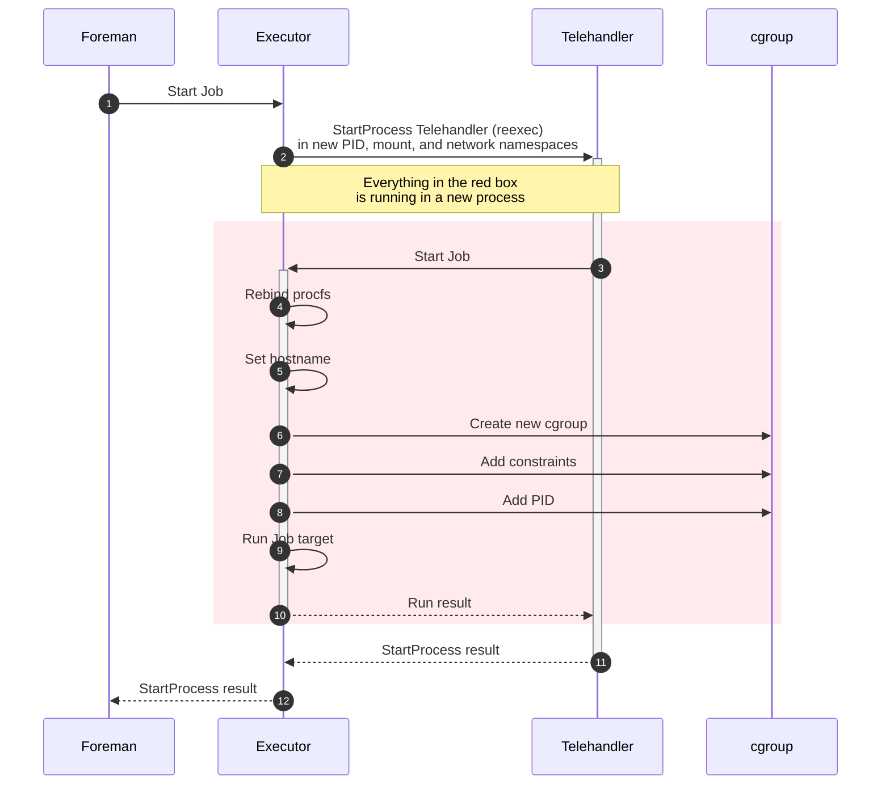

Author: [Ryan Reeves](github.com/drrev)

# Telehandler - Systems Code Challenge

See Teleport [systems challenge-1](https://github.com/gravitational/careers/blob/da6d4d1854f3814c6a9873c8ae17220008bdfebe/challenges/systems/challenge-1.md).

## What?

- A worker library with methods to start, stop, query status, and get the output of a job.
- Library should be able to stream the output of a running job.
  - Output should be from start of process execution.
  - Multiple concurrent clients should be supported.
- Add resource control for CPU, Memory and Disk IO per job using cgroups.
- Add resource isolation for using PID, mount, and networking namespaces.
- gRPC API to start, stop, query status, and get the output of a job.
- Use mTLS authentication and verify client certificate. Set up strong set of cipher suites for TLS and good crypto setup for certificates.
- Use a simple authorization scheme.
- CLI should be able to connect to worker service and start, stop, get status, and stream output of a job.

## Why?


- It helps Teleport to understand what to expect from me as a developer, how I write production code, how I reason about API design, and how I communicate when trying to understand a problem before I solve it.
- It helps me get a feel for what it would be like to work at Teleport, as this exercise aims to simulate our day-as-usual and expose me to the type of work Teleport is doing.


## Details



Telehandler is a simple service that is used to start, stop, query status, and watch the output of an arbitrary Linux process over gRPC.
The context of each process execution is called a job and is tracked using the `Job` type.
When a process is started using `StartJob`, a [resource name][aip-122] is returned to the user.
The resource name returned by `StartJob` is required to be passed to `StopJob`, `GetJobStatus`, and `WatchJobOutput`.

To prevent one job from consuming all compute resources on the Telehandler host: all jobs have hard-coded limits for CPU, memory, and disk IO utilization; additionally, all jobs are isolated into separate PID, mount, and network namespaces. For more information on both of these topics see [Control Groups](#control-groups) and [Namespaces](#namespaces).

A typical happy path scenario for running a job is outlined below:



### Job Lifecycle



- `RUNNING`: The underlying Linux process has been started, but has not exited.
- `FAILED`: The Linux process either failed to start or exited with a non-zero code.
- `STOPPED`: The job was stopped by a user before completing execution.
- `COMPLETED`: The Linux process started and exited successfully.

The Telehandler Job lifecycle is minimal due to the simplistic and synchronous nature of this system. Each Job is started synchronously in the `StartJob` call, so there is no need for a `PENDING` state or a more complicated substate design. There are no retries; jobs are all one-shot and run to completion--unless the job is interrupted by a call to `StopJob`.

### Job Execution

**IMPORTANT:** Job state is maintained for the entire lifetime of the Telehandler service. Once testing has finished, the service should be closed to reclaim resources. Additionally, refrain from testing commands that write large amounts of data to STDOUT or STDERR.

In order to properly support control groups (cgroups) and namespaces, bootstrapping code needs to execute to configure Linux **before** the job executes. For example, a PID of a *running* process **must** be added to `<cgroup_path>/cgroup.procs` to limit resources.

The cgroup API is problematic for the way that Go forks child processes; namely, there is no way to run any code before or after a child process executes. Additionally, Telehandler **should not** be resource constrained as a Job, which is what would happen by passing [`os.Getpid()`][getpid] into `cgroup.procs`. The cgroup could be setup before the process was forked, then the PID can be added; however, that leaves some time delta ($\Delta{t}$) from $t_0$ to $t_n$ in which the forked process would run without proper resource constraints.

To work around this issue, Telehandler does not fork the job target eagerly. Telehandler has a dedicated sub-command that is used to bootstrap the cgroup--and namespaces--before running the job target. Since the direct descendant of Telehandler would be another instance of Telehandler, the logic can be written to bootstrap a cgroup, add `os.Getpid()` to the group, then run the job target so that it inherits the cgroup constraints. Now, it is impossible for there to be any amount of time in which the job can execute without being part of a cgroup or namespace.

The process of Telehandler executing itself in order to bootstrap a child process is called re-execution (reexec):



Executor attempts to make the reexec wrapping completely transparent where possible.

#### Output Streaming

**IMPORTANT:** All output is kept in memory for the lifetime of the Telehandler service, which should be considered when testing this prototype. In future
versions, this can be resolved using file tailing.

To simplify output streaming, all output is multiplexed into a single stream. Due to this multiplexing process, it is possible to have `STDOUT` lines and `STDERR` lines that are out of order; in most cases, log lines should only be shifted by at most one.

Output can be streamed using `WatchJobOutput`, which backfills all output from the process epoch before streaming new output. Due to this behavior, `WatchJobOutput` doubles as a way
to stream historical output for Jobs that have terminated. If a Job is running, output will be streamed until the Job terminates or the client disconnects, whichever happens first.

Internally, each new `WatchJobOutput` call creates and registers a new `OutputSink` (sink) to a job's `OutputSource` (source). Each sink contains a channel that receives events from the source, which can then be streamed over gRPC to the client. When a sink is no longer needed, it is closed, which in turn unregisters the sink from the source. This model allows a source to fan out events. Each channel buffers up-to 4096 events; however, to prevent degradation of service to other watchers, a 1-second gRPC send timeout is used.

If sending to a watcher channel would block despite the gRPC send timeout, the channel will be closed and the client will need to reconnect.

#### Control Groups

Resource constraints are enforced using [Control Group v2][cgroup] (cgroup v2) in `domain` mode. In order to properly support cgroups, a new group must be created, configured, and finally the PID of the *running* target process **must** be added to `<cgroup_path>/cgroup.procs`; this bootstrapping is handled by the [Executor](#job-execution).

The following resource constraints are hard-coded and enforced on all jobs:

- **CPU**: CPU usage is limited using fraction-seconds via `cpu.max` such that each process is limited to `100ms` per-second or `10%` of each second.
- **Memory**: A low threshold is not set for memory, the default value of `0` is used. Maximum allowed memory per-process is `512MiB` with a throttle limit of `75%`--that is, `memory.max = 512MiB` and `memory.high = 384MiB`. No swap is available; therefore, `memory.swap.max` is pinned to `0`.
- **Disk IO**: The following limits are applied per-partition for **all** partitions on the host:
    - Max read bytes per second (rbps): 83886080 (10MiB/s)
    - Max write bytes per second (wbps): 41943040 (5MiB/s)
    - Max read IO operations per second (riops): 1000
    - Max write IO operations per second (wiops): 1000

#### Namespaces

Jobs are isolated into separate PID, mount, and network namespaces when the [Executor](#job-execution) reexecs. All bootstrapping for the namespace occurs **before** the Job process is started. As part of the bootstrapping process, `/proc` is remounted to hide host process information, and the hostname is forced to `sandbox` to hide the real hostname.

**IMPORTANT:** Due to scope, network connectivity was left out of this prototype, and the network namespace is unprovisioned; therefore, there is no external connectivity and any process requiring a network connection will fail. Suggestions are made for future work in [Network Connectivity](#network-connectivity).

### Foreman API

Job management is handled through the Foreman gRPC API that is outlined in the [proto spec](../proto/drrev/telehandler/foreman/v1alpha1/telehandler.proto).

#### Authentication

The Foreman API utilizes mTLS with TLS1.3 via the native [`crypto/tls`][crypto-tls] for two-way authentication. All certificate key pairs are self-signed and use ECDSA P-384. ECDSA was chosen for performance. Curve P-384 was chosen as [recommended by NIST for non-repudiation][nist].

> Note: Cipher suites for TLS1.3 [_cannot_ be configured][cipher-suites] in the native Go `cytpto/tls` package. One of the following cipher suites is automatically selected: TLS_AES_128_GCM_SHA256, TLS_AES_256_GCM_SHA384, or TLS_CHACHA20_POLY1305_SHA256.

Adapting this prototype to a production environment would require minimal uplift in Kubernetes to utilize [cert-manager's csi-driver][csi] with mounted certificate key pairs.


#### Authorization

Telehandler uses a simple authorization scheme based on the certificates issued to clients. A client must present a certificate with a Subject Common Name (CN) field matching `tele-tester` or the request is denied.

Advanced authorization is covered in [future work](#authorization-1).

### Command Line Interface

The CLI provides a simple management interface for interacting with the Foreman API. Each remote procedure call (RPC) has an associated sub-command:

- `start <command> [...args]`: Starts a new job that will execute the Linux process given.
- `stop <job_id>`: Stops the job, if the job is in a running state. If a job has already terminated, this is a no-op.
- `status <job_id>`: Checks the [state](#job-lifecycle) of the job and--if running--outputs the current cgroup stats for CPU, Memory, and Disk IO.
- `watch <job_id>`: Tails the output of the given job until the job exits. Note: Each time `watch` is called on a job, **all** output from the job is returned from the execution epoch until now.

At any time `help` can be run to get a full list of sub-commands. Additionally, each sub-command has a dedicated help section with a full description and any arguments specific to that command, i.e. `help start` will output a full description of the start and any arguments specific to `start`.

A full usage scenario might look like:
```bash
# Note the usage of `--` to signal the end of parameters.
# This MUST be included if the process to run includes arguments.
user@host$ ./telehandler start -- /bin/sh -c "sleep 30 && echo hello tele | tee /tmp/greeting"
e518e074-6051-42cb-ad7f-b03e7cfc6252
user@host$ ./telehandler status e518e074-6051-42cb-ad7f-b03e7cfc6252
state RUNNING
...
cpu.stat.usage_usec 10689632104
cpu.stat.user_usec 7877380021
cpu.stat.system_usec 2812252082
cpu.stat.core_sched.force_idle_usec 0
cpu.stat.nr_periods 0
cpu.stat.nr_throttled 0
cpu.stat.throttled_usec 0
cpu.stat.nr_bursts 0
cpu.stat.burst_usec 0
...
user@host$ ./telehandler watch e518e074-6051-42cb-ad7f-b03e7cfc6252
hello tele
user@host$ ./telehandler status e518e074-6051-42cb-ad7f-b03e7cfc6252
state COMPLETE
```

## Future Work

This section covers major concessions and future remediation approaches that can be taken to shore up the design.

### RootFS Replacement

Replacing the rootfs for full mount isolation can be added in the future; however, it would likely be better to use [libcontainer][runc] instead of using a custom implementation. Here is a rough outline of what the process looks like to replace a rootfs in the process mount namespace:
1. Download a root file system (rootfs), for example [alpine-minirootfs][alpine].
2. Extract a rootfs onto disk: `mkdir alpine-minirootfs && tar -xf alpine-minirootfs-*.tar.gz -C alpine-minirootfs`
3. Add the equivalent of `mount --rbind` to context initialization within the Executor to mount `alpine-minirootfs` using [`syscall.Mount`][mount] with flags `unix.MS_BIND | unix.MS_REC`.
4. Pivot root to prevent escape from the chroot using [`syscall.PivotRoot`][pivot_root] to swap the rootfs to `alpine-minirootfs` as part of context initialization.
5. Finally, change root into `alpine-minirootfs` using [`syscall.Chroot`][chroot].
6. The process now has a fully isolated rootfs.

### Network Connectivity

The complexity of providing full network connectivity capability made it untenable for a simple prototype.

Network connectivity can be added--if desired--by exposing configuration on the Job itself to define subnets, ports, bridge type, etc. During the bootstrap process for a new context, the network stack would be resolved by adding a network bridge, virtual Ethernet devices, routes, configuring network address translation (NAT) on the host, binding ports, etc.

Performing network configuration is highly complex and would be better served by adopting a dedicated library such as [netlink][netlink] or [libcontainer][runc].

### Authorization

In a production system, the simple authorization used by the initial prototype is severely lacking. One possible solution is to use OAuth with [certificate-bound access tokens][rfc8705].

To make the service production ready, there are multiple approaches that could be used for authorization that have different tradeoffs:
  1. Implement full RBAC within the Telehandler service that passes a verb, [resource name][aip-122], and the UID to verify that the user has permission to perform the requested operation against the provided resource.
     * RBAC implemented directly within the service can run complex checks within architectures that were designed without using resource names. For example, if a job has a simple ID with no resource hierarchy, the job must be resolved to determine ownership. This is not a trivial task in an external service.
  2. Create a dedicated external authorization service to perform authorization validation using either an existing policy enforcement tool like [ory keto][keto] or creating a custom tool that could be as simple as the aforementioned RBAC authorizer.
     * If resource names contain a full resource hierarchy, an external source can be used to apply policies quickly and effectively.
     * An external authorization service can be used for all services across an enterprise, significantly reducing complexity of each service.

In most cases, it is better to handle authorization before requests reach a service, so that policy enforcement can be maintained centrally with dedicated tooling. Since Telehandler already uses mTLS, it can simply trust that authorization checks have been performed prior to receiving requests.

[aip-122]: https://google.aip.dev/122
[alpine]: https://alpinelinux.org/downloads/
[cgroup]: https://docs.kernel.org/admin-guide/cgroup-v2.html
[chroot]: https://pkg.go.dev/syscall#Chroot
[cipher-suites]: https://cs.opensource.google/go/go/+/refs/tags/go1.23.2:src/crypto/tls/common.go;l=675-684
[crypto-tls]: https://pkg.go.dev/crypto/tls
[csi]: https://cert-manager.io/docs/usage/csi/
[getpid]: https://pkg.go.dev/os#Getpid
[keto]: https://www.ory.sh/docs/keto
[mount]: https://pkg.go.dev/syscall#Mount
[netlink]: https://github.com/vishvananda/netlink
[nist]: https://nvlpubs.nist.gov/nistpubs/specialpublications/nist.sp.800-57pt3r1.pdf
[pivot_root]: https://pkg.go.dev/syscall#PivotRoot
[rfc8705]: https://datatracker.ietf.org/doc/html/rfc8705
[runc]: https://github.com/opencontainers/runc/tree/main/libcontainer