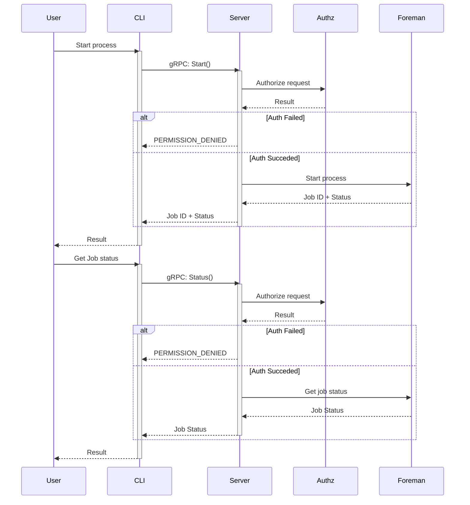
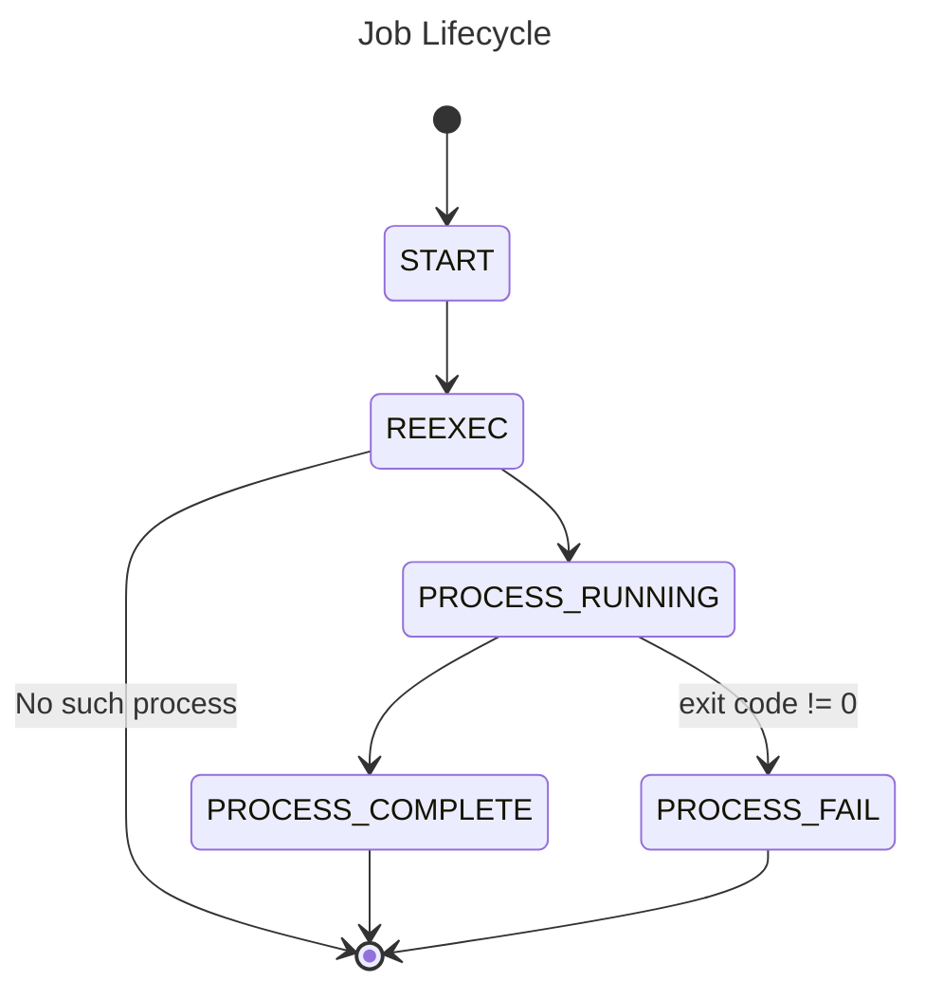

<!--
**Note:** When your RFC is complete, all of these comment blocks should be removed.

To get started with this template:

- [ ] **Pick a hosting SIG.**
  Make sure that the problem space is something the SIG is interested in taking
  up. RFCs should not be checked in without a sponsoring SIG.
- [ ] **Create an issue in kubernetes/enhancements**
  When filing an enhancement tracking issue, please make sure to complete all
  fields in that template. One of the fields asks for a link to the RFC. You
  can leave that blank until this RFC is filed, and then go back to the
  enhancement and add the link.
- [ ] **Make a copy of this template directory.**
  Copy this template into the owning SIG's directory and name it
  `NNNN-short-descriptive-title`, where `NNNN` is the issue number (with no
  leading-zero padding) assigned to your enhancement above.
- [ ] **Fill out as much of the kep.yaml file as you can.**
  At minimum, you should fill in the "Title", "Authors", "Owning-sig",
  "Status", and date-related fields.
- [ ] **Fill out this file as best you can.**
  At minimum, you should fill in the "Summary" and "Motivation" sections.
  These should be easy if you've preflighted the idea of the RFC with the
  appropriate SIG(s).
- [ ] **Create a PR for this RFC.**
  Assign it to people in the SIG who are sponsoring this process.
- [ ] **Merge early and iterate.**
  Avoid getting hung up on specific details and instead aim to get the goals of
  the RFC clarified and merged quickly. The best way to do this is to just
  start with the high-level sections and fill out details incrementally in
  subsequent PRs.

Just because a RFC is merged does not mean it is complete or approved. Any RFC
marked as `provisional` is a working document and subject to change. You can
denote sections that are under active debate as follows:

```
<<[UNRESOLVED optional short context or usernames ]>>
Stuff that is being argued.
<<[/UNRESOLVED]>>
```

When editing RFCS, aim for tightly-scoped, single-topic PRs to keep discussions
focused. If you disagree with what is already in a document, open a new PR
with suggested changes.

One RFC corresponds to one "feature" or "enhancement" for its whole lifecycle.
You do not need a new RFC to move from beta to GA, for example. If`
new details emerge that belong in the RFC, edit the RFC. Once a feature has become`
"implemented", major changes should get new RFCs.

The canonical place for the latest set of instructions (and the likely source
of this file) is [here](/keps/NNNN-kep-template/README.md).

**Note:** Any PRs to move a RFC to `implementable`, or significant changes once
it is marked `implementable`, must be approved by each of the RFC approvers.
If none of those approvers are still appropriate, then changes to that list
should be approved by the remaining approvers and/or the owning SIG (or
SIG Architecture for cross-cutting RFCs).
-->

# RFD-0001 - Telehandler: Arbitrary Linux Process Manager

<!--
This is the title of your RFC. Keep it short, simple, and descriptive. A good
title can help communicate what the RFC is and should be considered as part of
any review.
-->

<!--
A table of contents is helpful for quickly jumping to sections of a RFC and for
highlighting any additional information provided beyond the standard RFC
template.

Ensure the TOC is wrapped with
  <code>&lt;!-- toc --&rt;&lt;!-- /toc --&rt;</code>
tags, and then generate with `hack/update-toc.sh`.
-->

<!-- toc -->

- [RFD-0001 - Telehandler: Arbitrary Linux Process Manager](#rfd-0001---telehandler-arbitrary-linux-process-manager)
  - [Summary](#summary)
  - [Motivation](#motivation)
    - [Goals](#goals)
    - [Non-Goals](#non-goals)
  - [Proposal](#proposal)
  - [Design Details](#design-details)
    - [Definitions](#definitions)
    - [Design](#design)
      - [Authentication](#authentication)
      - [Authorization](#authorization)
      - [Resource Constraints: Control Groups](#resource-constraints-control-groups)
      - [Process Isolation: Namespaces](#process-isolation-namespaces)
    - [Notes/Constraints/Caveats (Optional)](#notesconstraintscaveats-optional)
    - [Risks and Mitigations](#risks-and-mitigations)
    - [Test Plan](#test-plan)
        - [Prerequisite testing updates](#prerequisite-testing-updates)
        - [Unit tests](#unit-tests)
        - [Integration tests](#integration-tests)
        - [e2e tests](#e2e-tests)
    - [Monitoring Requirements](#monitoring-requirements)
          - [Are there any missing metrics that would be useful to have to improve observability of this feature?](#are-there-any-missing-metrics-that-would-be-useful-to-have-to-improve-observability-of-this-feature)
    - [Dependencies](#dependencies)
    - [Scalability](#scalability)
    - [Troubleshooting](#troubleshooting)
  - [Drawbacks](#drawbacks)
  - [Alternatives](#alternatives)
<!-- /toc -->

## Summary

<!--
This section is incredibly important for producing high-quality, user-focused
documentation such as release notes or a development roadmap. It should be
possible to collect this information before implementation begins, in order to
avoid requiring implementors to split their attention between writing release
notes and implementing the feature itself. RFC editors and SIG Docs
should help to ensure that the tone and content of the `Summary` section is
useful for a wide audience.

A good summary is probably at least a paragraph in length.

Both in this section and below, follow the guidelines of the [documentation
style guide]. In particular, wrap lines to a reasonable length, to make it
easier for reviewers to cite specific portions, and to minimize diff churn on
updates.

[documentation style guide]: https://github.com/kubernetes/community/blob/master/contributors/guide/style-guide.md
-->

<!--
As a first step, please submit a design document outlining key design decisions,
scope & tradeoffs, security (authn/authz), API, UX, etc.
for https://github.com/gravitational/careers/blob/main/challenges/systems/challenge-1.md
-->

Telehandler is a job worker service that provides an API for running arbitrary Linux processes with
support for constraining and isolating resources.

## Motivation

<!--
This section is for explicitly listing the motivation, goals, and non-goals of
this RFC.  Describe why the change is important and the benefits to users. The
motivation section can optionally provide links to [experience reports] to
demonstrate the interest in a RFC within the wider Kubernetes community.

[experience reports]: https://github.com/golang/go/wiki/ExperienceReports
-->


### Goals

<!--
List the specific goals of the RFC. What is it trying to achieve? How will we
know that this has succeeded?
-->


- Worker library with methods to start, stop, query status, and get the output of a job.
- Library should be able to stream the output of a running job.
  - Output should be from start of process execution.
  - Multiple concurrent clients should be supported.
- Add resource control for CPU, Memory and Disk IO per job using cgroups.
- Add resource isolation for using PID, mount, and networking namespaces.
- gRPC API to start, stop, query status, and get the output of a job.
- Use mTLS authentication and verify client certificate. Set up strong set of cipher suites for TLS and good crypto setup for certificates.
- Use a simple authorization scheme.
- CLI should be able to connect to worker service and start, stop, get status, and stream output of a job.

### Non-Goals

<!--
What is out of scope for this RFC? Listing non-goals helps to focus discussion
and make progress.
-->

- Resource constraint and isolation is not configurable via the API.
- Support any authentication beyond mTLS.

## Proposal

<!--
This is where we get down to the specifics of what the proposal actually is.
This should have enough detail that reviewers can understand exactly what
you're proposing, but should not include things like API designs or
implementation. What is the desired outcome and how do we measure success?.
The "Design Details" section below is for the real
nitty-gritty.
-->

## Design Details

<!--
This section should contain enough information that the specifics of your
change are understandable. This may include API specs (though not always
required) or even code snippets. If there's any ambiguity about HOW your
proposal will be implemented, this is the place to discuss them.
-->

<!-- 
The telehandler design consists of a few key components:
1. **Foreman**: Manages workers and coordinates the execution of jobs.
2. **Worker**: Contains the context for process execution and carries out job execution.
3. **Executor**: Wraps job execution to set up IO, namespaces, and cgroups.
### Foreman

### Worker

### Executor

### Job Status -->


The service maintains **all** output and states from **all** jobs--both past and present--in memory. Special consideration should be
given when running jobs that can generate a significant amount of output. The service _should_ be restarted periodically to free
memory.


### Definitions

- **cgroup**: [Linux Control Groups][^1] are used to constrain resource utilization for: CPU, memory, and Disk IO.
- **job**: The full context for the execution of an arbitrary Linux process.
- **namespace**: [Linux namespaces][^2] are used to isolate resources by providing a process with their own instance of a global resource. The following namespaces are enforced: [PID][^3], [mount][^4], and [network][^5].
- **pid**: (Also: `pid`). A unique process identifier.

[^1]: https://docs.kernel.org/admin-guide/cgroup-v2.html
[^2]: https://man7.org/linux/man-pages/man7/namespaces.7.html
[^3]: https://www.man7.org/linux/man-pages/man7/pid_namespaces.7.html
[^4]: https://man7.org/linux/man-pages/man7/mount_namespaces.7.html
[^5]: https://man7.org/linux/man-pages/man7/network_namespaces.7.html

### Design

The telehandler service is a simple job executor with a small API to start, stop, check status, and stream the output of jobs. Colloquially, a job refers to the full context associated with the execution of an arbitrary Linux process. Formally, this context is stored within `Job` objects.

1. Any number of jobs may be executed at a given time.
2. Each job is identified using a resource name of the form `users/{user_id}/jobs/{job_id}`.
3. 







#### Authentication

Authentication between the client and server is done via mTLS with [ECDSA P-384][^1]. ECDSA was chosen for performance. Curve P-384 was chosen as recommended by NIST for non-repudiation.

Generation for all certificates and keys is completed using [cfssl][^2]. 

[^1]: https://nvlpubs.nist.gov/nistpubs/specialpublications/nist.sp.800-57pt3r1.pdf
[^2]: https://github.com/cloudflare/cfssl


#### Authorization

Authorization is implemented through the inclusion of the user identifier (UID) within the certificate issued to the client using the ____ field. Only a certificate issued
to the UID `` is allowed to operate this service.

In a production system, there are multiple approaches that could be used for authorization that have different tradeoffs:
  1. Implement full RBAC within the telehandler service that passes a verb, [resource name][^1], and the UID to verify that the user has permission to perform the requested operation against the provided resource.
     * RBAC implemented directly within the service can run complex checks within architectures that were designed without using resource names. For example, if a job has a simple ID with no resource hierarchy, the job must be resolved to determine ownership. This is not a trivial task in an external service.
  2. Create a dedicated external authorization service to perform authorization validation using either an existing policy enforcement tool like [ory keto][^2] or creating a custom tool that could be as simple as the aforementioned RBAC authorizer.
     * If resource names contain a full resource hierarchy, an external source can be used to apply policies quickly and effectively.
     * An external authorization service can be used for all services across an enterprise, significantly reducing complexity of each service.

In most cases, it is better to handle authorization before requests reach telehandler, so that policy enforcement does not need to be maintained as part of this service. Since telehandler already uses mTLS, it can simply trust that authorization checks have been performed prior to receiving requests.


[^1]: https://google.aip.dev/122#full-resource-names
[^2]: https://www.ory.sh/docs/keto

#### Resource Constraints: Control Groups

Resources constraints are hard-coded and enforced using cgroup v2.

In a production environment, a `Constraint` type would be added to `Job` to allow
configurable resource constraints. As an early prototype, configurable constraints was omitted due to validation, enforcement, and design complexity.

#### Process Isolation: Namespaces

Processes executed as part of a `Job` are isolated PID, mount, and network via Linux namespaces. Processes are executed within 

While telehandler does not limit which commands are executed, commands _do not_ have network access; therefore, any commands that require access to network resources
will fail.

```bash
[user@arch-desktop probing]$ lsns | rg run-in-runtime
4026537363 user        2 78218 user run-in-runtime /bin/sh
4026537367 uts         2 78218 user run-in-runtime /bin/sh
4026537368 pid         2 78218 user run-in-runtime /bin/sh
4026537369 mnt         2 78218 user run-in-runtime /bin/sh
4026537370 net         2 78218 user run-in-runtime /bin/sh
[user@arch-desktop probing]$ pstree -lsp 78218```
systemd(1)───systemd(1285)───...───bash(74314)───example(78213)───exe(78218)─┬─sh(78224)
                                                                             ├─{exe}(78219)
                                                                             ├─{exe}(78220)
                                                                             ├─{exe}(78221)
                                                                             ├─{exe}(78222)
                                                                             └─{exe}(78223)
```

```bash
sandbox # lsns       
        NS TYPE   NPROCS PID USER COMMAND
4026531834 time        3   1 root run-in-runtime /bin/sh
4026531835 cgroup      3   1 root run-in-runtime /bin/sh
4026531839 ipc         3   1 root run-in-runtime /bin/sh
4026537363 user        3   1 root run-in-runtime /bin/sh
4026537365 uts         3   1 root run-in-runtime /bin/sh
4026537366 pid         3   1 root run-in-runtime /bin/sh
4026537367 mnt         3   1 root run-in-runtime /bin/sh
4026537368 net         3   1 root run-in-runtime /bin/sh
sandbox # pstree -lsp 1
exe(1)-+-sh(7)---pstree(9)
       |-{exe}(2)
       |-{exe}(3)
       |-{exe}(4)
       |-{exe}(5)
       `─{exe}(6)
```

### Notes/Constraints/Caveats (Optional)

<!--
What are the caveats to the proposal?
What are some important details that didn't come across above?
Go in to as much detail as necessary here.
This might be a good place to talk about core concepts and how they relate.
-->

### Risks and Mitigations

<!--
What are the risks of this proposal, and how do we mitigate? Think broadly.
For example, consider both security and how this will impact the larger
Kubernetes ecosystem.

How will security be reviewed, and by whom?

How will UX be reviewed, and by whom?

Consider including folks who also work outside the SIG or subproject.
-->

### Test Plan

<!--
**Note:** *Not required until targeted at a release.*
The goal is to ensure that we don't accept enhancements with inadequate testing.

All code is expected to have adequate tests (eventually with coverage
expectations). Please adhere to the [Kubernetes testing guidelines][testing-guidelines]
when drafting this test plan.

[testing-guidelines]: https://git.k8s.io/community/contributors/devel/sig-testing/testing.md
-->

[ ] I/we understand the owners of the involved components may require updates to
existing tests to make this code solid enough prior to committing the changes necessary
to implement this enhancement.

##### Prerequisite testing updates

<!--
Based on reviewers feedback describe what additional tests need to be added prior
implementing this enhancement to ensure the enhancements have also solid foundations.
-->

##### Unit tests

<!--
In principle every added code should have complete unit test coverage, so providing
the exact set of tests will not bring additional value.
However, if complete unit test coverage is not possible, explain the reason of it
together with explanation why this is acceptable.
-->

<!--
Additionally, for Alpha try to enumerate the core package you will be touching
to implement this enhancement and provide the current unit coverage for those
in the form of:
- <package>: <date> - <current test coverage>
The data can be easily read from:
https://testgrid.k8s.io/sig-testing-canaries#ci-kubernetes-coverage-unit

This can inform certain test coverage improvements that we want to do before
extending the production code to implement this enhancement.
-->

- `<package>`: `<date>` - `<test coverage>`

##### Integration tests

<!--
Integration tests are contained in k8s.io/kubernetes/test/integration.
Integration tests allow control of the configuration parameters used to start the binaries under test.
This is different from e2e tests which do not allow configuration of parameters.
Doing this allows testing non-default options and multiple different and potentially conflicting command line options.
-->

<!--
This question should be filled when targeting a release.
For Alpha, describe what tests will be added to ensure proper quality of the enhancement.

For Beta and GA, add links to added tests together with links to k8s-triage for those tests:
https://storage.googleapis.com/k8s-triage/index.html
-->

- <test>: <link to test coverage>

##### e2e tests

<!--
This question should be filled when targeting a release.
For Alpha, describe what tests will be added to ensure proper quality of the enhancement.

For Beta and GA, add links to added tests together with links to k8s-triage for those tests:
https://storage.googleapis.com/k8s-triage/index.html

We expect no non-infra related flakes in the last month as a GA graduation criteria.
-->

- <test>: <link to test coverage>

### Monitoring Requirements

<!--
This section must be completed when targeting beta to a release.

For GA, this section is required: approvers should be able to confirm the
previous answers based on experience in the field.
-->

###### Are there any missing metrics that would be useful to have to improve observability of this feature?

<!--
Describe the metrics themselves and the reasons why they weren't added (e.g., cost,
implementation difficulties, etc.).
-->

### Dependencies

<!--
This section must be completed when targeting beta to a release.
-->

### Scalability

<!--
For alpha, this section is encouraged: reviewers should consider these questions
and attempt to answer them.

For beta, this section is required: reviewers must answer these questions.

For GA, this section is required: approvers should be able to confirm the
previous answers based on experience in the field.
-->

### Troubleshooting

<!--
This section must be completed when targeting beta to a release.

For GA, this section is required: approvers should be able to confirm the
previous answers based on experience in the field.

The Troubleshooting section currently serves the `Playbook` role. We may consider
splitting it into a dedicated `Playbook` document (potentially with some monitoring
details). For now, we leave it here.
-->

## Drawbacks

<!--
Why should this RFC _not_ be implemented?
-->

## Alternatives

<!--
What other approaches did you consider, and why did you rule them out? These do
not need to be as detailed as the proposal, but should include enough
information to express the idea and why it was not acceptable.
-->
